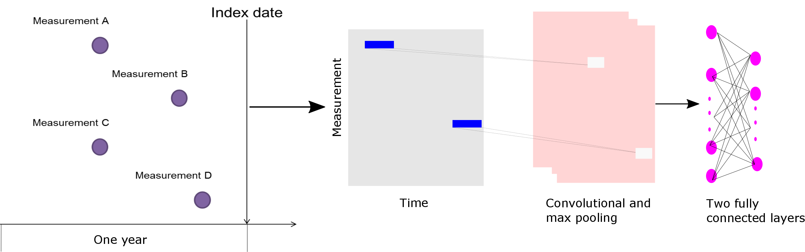

```{r setup, include=FALSE}
knitr::opts_chunk$set(echo = TRUE)
```

```{r, echo = FALSE, message = FALSE, warning = FALSE}
library(PatientLevelPrediction)
vignetteDataFolder <- "s:/temp/plpVignette"
# Load all needed data if it exists on this computer:
if (file.exists(vignetteDataFolder)){
  plpModel <- loadPlpModel(vignetteDataFolder,'model')
  lrResults <- loadPlpModel(file.path(vignetteDataFolder,'results'))
}
```

\newpage
# Introduction

The success of machine learning largely depends on the selection of an optimal feature representation. In the early days, the machine learning community mainly focused on algorithm development. Due to high dimensionality, heterogeneity, incompleteness, noise and biases of EHR data, currently extracting relevant clinical phenotypes from EHR data is shifting to more powerful feature engineering. Deep learning models are widely used to automatically learn high-level features from raw data, and have achieved remarkable results in image processing,  speech recognition and computational biology. Recently, interesting results have been shown in healthcare applications.

#Background

Deep learning can automatically extract high-level features from data, which concisists of multiple layers of neural network stacked. How to use deep learning for EHR data recently attracts many attention, especially for huge volume of medical record data. Thus, in PatientLevelPrediction package, we also add support for deep learning, which is integrated into PatientLevelPrediction with the same interface as other conventioanl machine learning models. 



Many network architectures have recently been developed. For different deep leanring models, they require different data input format. For Convolutional neural netowrk (CNN) or Recurrent neural network (RNN), they require the temporal information, which can be treated as 3D matrix |patient|x|feature|X|cohort time|. For multilayer perceptron, they just need the 2D input matrix, which requires encoding the features using multi-hot encoding for all avaliable information. We mainly implement the followings using Pytorch:
For non-temporal data:
	1. Logistics regression (LRTorch)
	2. Feedforward network (MLPTorch), it supports multilayer perceptron and self-normalizing neural network. 
For the above two methods, it support stacked autoencoder and variational autoencoders, which are used to reduce the feature dimension by autoencoder before feeding into MLP and logistics regression. 
Autoencoder learns efficient data codings in unsupervised manner by stacking multiple layers of networks.

For temporal data:
	3. Convolutional neural network (CNNTorch), it supports two-layers CNN, CNN_LSTM, and the network architectures proposed in deepDiagnosis(https://github.com/clinicalml/deepDiagnosis)
	4. Recurrent neural network (RNNTorch), it supports LSTM, Bidirectional LSTM and GRU.

NOTICE: The authors can go to python file deepTorch.py to add their own network architectures or change the aleardy implemented architectures.

# GPU or CPU 
Our implementation support both GPU and CPU. It will automatically check whether there is GPU or not in the computer. If there exists GPUs, it automatically run the model training on GPUs. Otherwise it will run on CPUs.

# Usage

# LRTorch and MLPTorch
It uses the same input as LASSO and Random forest.
Use the [OHDSI tool ecosystem](https://github.com/OHDSI) to generate a `population` and `plpData` object. 

Alternatively, you can make use of the data simulator. The following code snippet creates a population of 12000 patients.

```{r eval=FALSE}
set.seed(1234)
data(plpDataSimulationProfile)
sampleSize <- 12000
plpData <- simulatePlpData(
  plpDataSimulationProfile,
  n = sampleSize
)

population <- createStudyPopulation(
  plpData,
  outcomeId = 2,
  binary = TRUE,
  firstExposureOnly = FALSE,
  washoutPeriod = 0,
  removeSubjectsWithPriorOutcome = FALSE,
  priorOutcomeLookback = 99999,
  requireTimeAtRisk = FALSE,
  minTimeAtRisk = 0,
  riskWindowStart = 0,
  addExposureDaysToStart = FALSE,
  riskWindowEnd = 365,
  addExposureDaysToEnd = FALSE,
  verbosity = futile.logger::INFO
)
```

Specify the prediction algorithm MLPTorch or LRTorch.

```{r eval=FALSE}
# Use Logistics regression
model <- setLRTorch()
```


Alternatively, we can specify the stakced autoencoder to be used for reducing the feature dimension.

```{r}
# Use stacked autoencoder .
autoencoder <- FALSE
```

Specify the variational autoencoder to be used for reducing the feature dimension.

```{r}
# Use variational autoencoder .
vae <- FALSE
```


Specify a class_weight for imbalanced data, the default value is the inverse ratio between negative and positives. 

```{r eval = FALSE}
class_weight <- 2

```

```{r eval=FALSE}
# Use Logistics regression
model <- setLRTorch(autoencoder=autoencoder, vae=vae,  class_weight=class_weight)
```


Specify a test fraction and a sequence of training set fractions.

```{r eval = FALSE}
testFraction <- 0.2

```

Specify the test split to be used.

```{r}
# Use a split by person, alterantively a time split is possible
testSplit <- 'person'
```


Run the model training.

```{r eval=FALSE}
results <- PatientLevelPrediction::runPlp(population, plpData, 
                                                    model,
                                                    testSplit=testSplit,
                                                    testFraction=testFraction,
                                                    nfold=3, splitSeed=1000) 
```


# Apply the trained model
```{r eval=FALSE}
plpData <- loadPlpData("plpdata/")
model <- loadPlpModel("/data/home/xpan/git/PatientLevelPrediction/plpmodels/20180607153811")
use the same population settings as the model:
populationSettings <- plpModel$populationSettings
populationSettings$plpData <- plpData
population <- do.call(createStudyPopulation, populationSettings)
```
Get the prediction, please make sure the ensemble strategy for training and applying is the same:
```{r eval=FALSE}
prediction <- results <- applyModel(population, plpData, model, calculatePerformance=T)$prediction
```

# CNNTorch and RNNTorch
For CNN and RNN, it requries temporal data as inputs.

# Usage

Use the [OHDSI tool ecosystem](https://github.com/OHDSI) to generate a `population` and `plpData` object. Where plpData is temporal and it can be extracted as follows:
```{r eval=FALSE}
settings <- createTemporalCovariateSettings(useConditionEraStart = FALSE,
                                            useConditionEraOverlap = FALSE,
                                            useConditionOccurrence = FALSE,
                                            useConditionEraGroupStart = FALSE,
                                            useConditionEraGroupOverlap = FALSE,
                                            useDrugExposure = FALSE,
                                            useDrugEraStart = FALSE,
                                            useDrugEraOverlap = FALSE,
                                            useMeasurement = FALSE,
                                            useMeasurementValue = TRUE,
                                            useMeasurementRangeGroup = FALSE,
                                            useProcedureOccurrence = FALSE,
                                            useDeviceExposure = FALSE,
                                            useObservation = FALSE,
                                            excludedCovariateConceptIds = c(316866),
                                            addDescendantsToExclude = TRUE,
                                            temporalStartDays = seq(from = -365, to = -1, by = 12), 
                                            temporalEndDays = c(seq(from = -353, to = 0, by = 12), 0))

plpData <- getPlpData(connectionDetails = connectionDetails,
                        cdmDatabaseSchema = cdmDatabaseSchema,
                        cohortDatabaseSchema = "results",
                        cohortTable = "cohort",
                        cohortId = 11,
                        covariateSettings = settings,
                        outcomeDatabaseSchema = resultsDatabaseSchema,
                        outcomeTable = "cohort",
                        outcomeIds = 25,
                        cdmVersion = 5)

```

Specify the prediction algorithm CNNTorch or RNNTorch.
```{r eval=FALSE}
# Use CNN as an example
model <- setCNNTorch()
```

Alternatively, we can specify different network architectures.

```{r}
# specify the type of CNN.
cnn_type <- 'CNN' or "CNN_LSTM", "CNN_MLF", "CNN_MIX", "CNN_MULTI" 
```

Specify a class_weight for imbalanced data, the default value is the inverse ratio between negative and positives. 

```{r eval = FALSE}
class_weight <- 2

```

```{r eval=FALSE}
# Use Logistics regression
model <- setCNNTorch(class_weight=class_weight, cnn_type=cnn_type)
```

Specify a test fraction and a sequence of training set fractions.

```{r eval = FALSE}
testFraction <- 0.2

```


Specify the test split to be used.

```{r}
# Use a split by person, alterantively a time split is possible
testSplit <- 'person'
```

Run the model training.

```{r eval=FALSE}
results <- PatientLevelPrediction::runPlp(population, plpData, 
                                                    model,
                                                    testSplit=testSplit,
                                                    testFraction=testFraction,
                                                    nfold=3, splitSeed=1000) 
```


# Apply the trained model
```{r eval=FALSE}
plpData <- loadPlpData("plpdata/")
model <- loadPlpModel("/data/home/xpan/git/PatientLevelPrediction/plpmodels/20180607153811")
use the same population settings as the model:
populationSettings <- plpModel$populationSettings
populationSettings$plpData <- plpData
population <- do.call(createStudyPopulation, populationSettings)
```
Get the prediction, please make sure the ensemble strategy for training and applying is the same:
```{r eval=FALSE}
prediction <- results <- applyModel(population, plpData, model, calculatePerformance=T)$prediction
```

 
